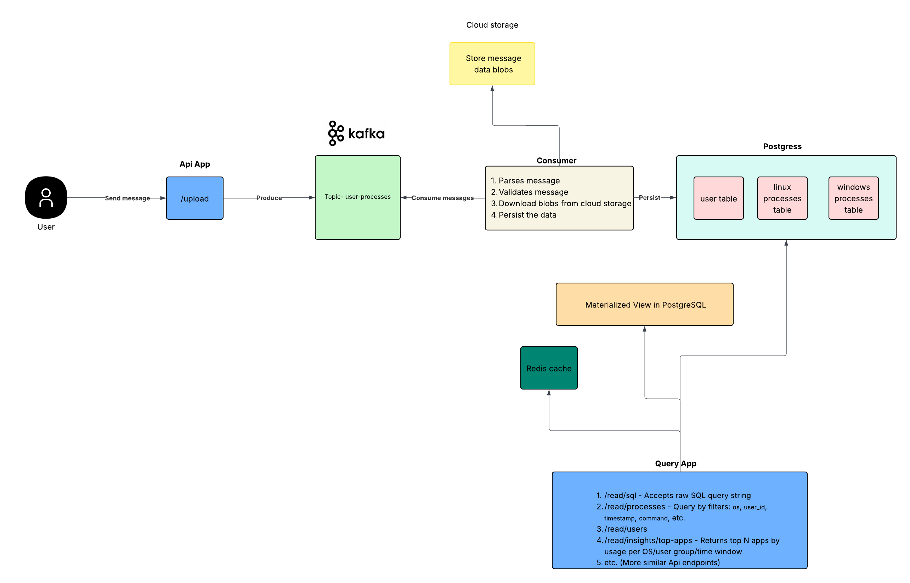

# Dream Project

Dream is a Go microservice for ingesting, parsing, and storing process data from different operating systems (Linux, Windows, macOS) for research analytics. It supports analytics queries by user, faculty, OS, and time, and is built with Kafka, PostgreSQL, and Docker Compose.


## High level architecture

## Technology Choices

### Why Go?
Go was chosen for its simplicity, performance, and strong support for concurrency. Its lightweight goroutines make it ideal for building microservices that handle high-throughput data processing efficiently.

### Why Kafka?
Kafka was selected as the messaging system due to its ability to handle large volumes of data with high reliability and scalability. It provides robust features for distributed systems, making it suitable for real-time data ingestion and processing.

### Why PostgreSQL?
PostgreSQL was chosen as the database for its advanced features, reliability, and strong support for complex queries. It is well-suited for handling structured data and supports analytics queries efficiently.

### Why Docker Compose Locally?
Docker Compose was chosen for local development to simplify the setup and management of dependencies like Kafka and PostgreSQL. It allows developers to run the entire stack with minimal configuration.

### Kubernetes in Production
While Docker Compose is used locally, Kubernetes (K8s) is planned for production deployment to ensure scalability, fault tolerance, and efficient resource management in a distributed environment.

> **Note:** Due to the scope and requirements of this project, cloud storage was not used. Instead, the database schema uses a string field to hold the full command output for each process record. This simplifies local development and testing, but may be revisited for scalability in a production environment.


## Additional components that couldnt be put in the task due to time constraints-
- Metrics support 
  - I would use a library such as OpenTelemetry for emitting metrics and collecting data such as:
    - Request latency
    - Error rates
    - Service availability
  - Distributed tracing to trace requests across microservices and identify bottlenecks or issues in the system.
- Logging 
  - I would use a structured logging library such as logrus or zap to capture detailed logs for debugging and monitoring purposes.
- Security 
  - I would implement security measures such as authentication and authorization to protect sensitive data and ensure that only authorized users can access the system.
  - I would add a scrubber service to remove all PII (Personally Identifiable Information) from the data before it is stored in the database.
  - I would use a managed service such as key vault to store sensitive information such as API keys, database credentials, and other secrets.
  - I would implement rate limiting to prevent abuse of the API and protect against denial-of-service attacks.
  - I would implement a circuit breaker pattern to prevent cascading failures in the system and improve resilience.
- API Documentation 
  - I would use a tool such as Swagger or OpenAPI to generate API documentation for the microservice, making it easier for developers to understand and use the API.
- CI/CD Pipeline 
  - I would set up a continuous integration and continuous deployment (CI/CD) pipeline to automate the build, test, and deployment processes, ensuring that changes are deployed quickly and reliably.
- K8s support 
  - I would add Kubernetes support to the project to enable deployment and scaling of the microservice in a production environment.
  - This would include creating Kubernetes manifests for deploying the microservice, configuring service discovery, and setting up load balancing.
- Splitting the project into 2 different microservices
  - the producer and consumer shouldn't be part of the same monolith, but they should be 2 different microservices that should scale independently
- Kafka commit offset
   - Currently there is no offset commit, so once the servivce is restarted, it will reprocess all the messages in the topic. This can be fixed by implementing offset management in the consumer service.
- Storage support 
   - The commands output in the final implementation should be uploaded to storage blob (such as aws s3, azure storage, etc.). The api endpoint should download it from there rather than receiving it as a string. 
- Disaster recovery
   - The service should be deployed to multiple data centers and multiple regions for disaster recovery purposes. This would ensure that the service is highly available and can withstand failures in one or more data centers or regions.


## Prerequisites

- [Go 1.21 or later](https://go.dev/doc/install)
- [Make](./Makefile) (for using Makefile commands)
- [Docker](https://www.docker.com/get-started) (required for running the app and dependencies locally)
- [Docker Compose](https://docs.docker.com/compose/) (for orchestrating multi-container setup)

## Running the Application

### Using Make

The project includes a [Make](./Makefile) with common development commands:


## Running the App with Docker Compose

To build and run the application and all dependencies (Postgres, Kafka, etc.) using Docker Compose:

```sh
make docker-up-build
```

- The app will be available at http://localhost:8080
- Logs can be viewed with:
  ```sh
  docker-compose logs -f app
  ```
- To stop all services:
  ```sh
  docker-compose down
  ```

## Unit Tests
  ```sh
  make test
  ```
## System Tests

System tests are located in `system_test.go` and are designed to verify the end-to-end functionality of the application
  ```sh
  make test-system
  ```

---

For more details on scripts and utilities, see the [scripts/README.md](scripts/README.md) file. 